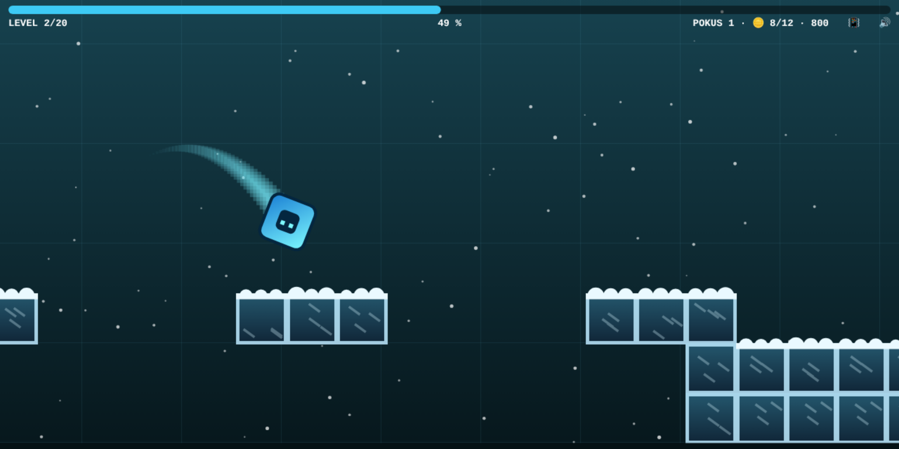
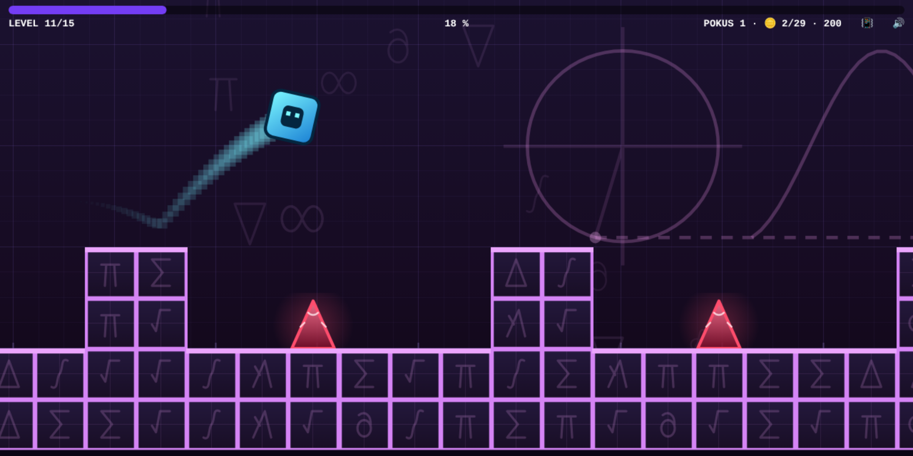
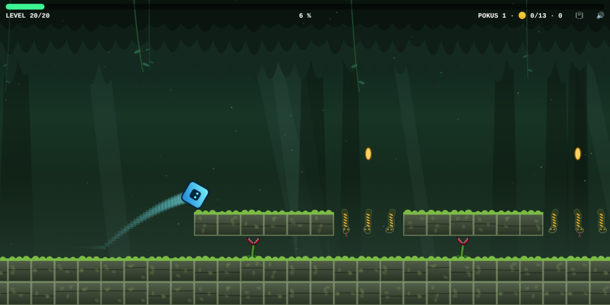

# Cube Runner

Skákací arkáda ve stylu Geometry Dash napsaná v čistém JavaScriptu (ES moduly),
která běží celá na HTML `<canvas>`. Bez frameworků, bez závislostí, bez build kroku.

Kostka běží sama pořád doprava a jediné, co s ní hráč dělá, je skok. Hra obsahuje
20 úrovní a každá stojí na vlastní sadě překážek – propasti, plošiny, pily,
odrazové plošiny, skokové prstence, obrácená gravitace –, takže se kola
neopakují. S každou úrovní roste rychlost i hustota překážek.

**Prostředí se po hře střídají**, nejdou po blocích: ledová jeskyně, poušť,
sopečná sloj, matematický svět i džungle se prokládají od začátku do konce,
takže žádná část hry nevypadá – a nezní – dlouho stejně. Prostředí je vzhled
a hudba; obtížnost drží rychlost a překážky.

Prostřední kapitola (úrovně 11–15) běží o 60 až 85 % rychleji než první úroveň
a čekají v ní pasti, které jednou překážkou neprojdeš: propast, přes kterou se
dostaneš jen odrazovou plošinou a prstencem, portál nad prázdnotou, běh po stropě
s dírami, nebo chodba, ve které strop krátí skok zrovna nad propastí.

Poslední kapitola (úrovně 16–20) běží na 190 až 210 % a mění se v ní i to, o čem
hra je: skok tam přeletí přes deset políček, takže hustota překážek už
nerozhoduje – odrazit se musíš dávno před propastí a hlídat, kam doskočíš.
Čekají tam plošiny v korunách s děrami, ostrůvky s roztečí přesně na délku skoku,
chodníček na kůlech, brána, kterou otevře jen odrazová plošina, a nakonec rokle,
přes kterou tě přenese teprve plošina s prstencem dohromady.

Zvukové efekty i hudba na pozadí se skládají přímo v prohlížeči, takže hra
nepotřebuje žádné zvukové soubory. Na telefonu k nim přibude haptická odezva –
každá událost vibruje po svém.

**▶️ Zahrát online: <https://joseftraxler.github.io/cube-runner/>**







## Ovládání

| Akce                          | Klávesy                          | Dotyk / myš               |
|-------------------------------|----------------------------------|---------------------------|
| Skok                          | `mezerník`, `↑`, `W` nebo `Enter`| ťuknutí kamkoli do hry    |
| Pauza                         | `P` nebo `Esc`                   | ťuknutí do horního pruhu  |
| Restart úrovně                | `R`                              | –                         |
| Zvuk zapnout / vypnout        | `M`                              | ťuknutí na ikonu vpravo nahoře |
| Vibrace zapnout / vypnout     | `H`                              | ťuknutí na ikonu vedle zvuku |
| Start / pokračování           | `mezerník`                       | ťuknutí                   |

Tlačítko skoku se dá **držet** – kostka pak vyskočí znovu hned, jak dopadne.
Skákat jde jen ze země (nebo ze skokového prstence), ve vzduchu už s letem nic
neuděláš, takže jde všechno o načasování.

Cílem je doběhnout na konec úrovně. Náraz do hrotu, do pily i do boku bloku
znamená smrt, stejně jako pád do propasti. Umřít nevadí – úroveň se hned rozeběhne
znovu od začátku, počítá se jen počet pokusů a nejdále dosažený postup (bílá
značka v ukazateli nahoře). Po cestě se dají sbírat **mince** za body; k dokončení
úrovně potřeba nejsou.

## Herní prvky

| Prvek                | Co dělá                                                              |
|----------------------|----------------------------------------------------------------------|
| Blok                 | Dá se na něj doskočit shora. Náraz do boku = smrt.                    |
| Hrot                 | Smrtící. Stojí na zemi, nebo visí ze stropu.                          |
| Propast              | Díra v podlaze – kostka propadne a umře.                              |
| Pila                 | Rotující kotouč, smrtící při dotyku.                                  |
| Koule na řetězu      | Obíhá kolem kotvy, takže je smrtící jinde v jinou chvíli – podle toho, kde zrovna je, se pod ní proběhne, nebo se přeskočí. |
| Odrazová plošina     | Při dotyku vymrští kostku o dost výš než běžný skok (i bez stisku).   |
| Skokový prstenec     | Ve vzduchu z něj jde na stisk skočit znovu. Jednou za pokus.          |
| Gravitační portál    | Otočí gravitaci – kostka spadne na strop a běží po něm hlavou dolů. Nízký portál jde přeskočit a zůstat dole, vysoký ne. |
| Mince                | Bonusové body, sbírání je nepovinné.                                  |
| Rozcestí             | Dvě cesty vedle sebe: dole se jen skáče, nahoře jsou mince navíc.     |
| Past                 | Odrazová plošina pod visícími hroty – kdo na ni šlápne, je vymrštěn do nich. Musí se přeskočit. |
| Propast s prstencem  | Širší, než kam doletí skok: přeneseš se přes ni jen prstencem, někdy až po odrazu z plošiny. |
| Past s prstencem     | Nad prstencem visí hroty – odrazit se z něj smíš až při klesání, ne hned ve vrcholu skoku. |
| Díra ve stropě       | Při obrácené gravitaci je strop podlaha, takže dírou v něm kostka vyletí z mapy. Přeskakuje se jako propast. |
| Vyvýšený doskok      | Plošina, na kterou se doskakuje přes propast: kdo doletí nízko, narazí do její stěny. |
| Nízký strop nad dírou| Strop uřízne vrchol skoku, takže díru pod ním musíš přeletět kratším obloukem. |

Skok je vždycky stejně vysoký: vyskočí na blok vysoký **2 políčka** a přeskočí
díru širokou **4 políčka**. S vyšší rychlostí úrovně se skok neprodlužuje do výšky,
ale doletí dál – a času na reakci je míň.

## Zvuk

Hra nepoužívá žádné zvukové soubory – **efekty i hudba se skládají za běhu**
přes Web Audio API (oscilátory a šum). Každá úroveň má vlastní stupnici,
harmonii i tempo odvozené od své rychlosti, takže s obtížností roste i tah hudby.

**Každé prostředí hraje po svém.** Motiv se řídí tématem úrovně – nemění se jen
barvy, ale i nástroje a styl:

| Prostředí        | Jak zní                                                                 |
|------------------|-------------------------------------------------------------------------|
| bez tématu       | temné synthwave – kopák, rozladěné pily v base, hranatá melodie          |
| ledová jeskyně   | poloviční tempo, zvonky s dlouhou ozvěnou, praskání ledu místo virblu    |
| sopečná sloj     | dvojkopák, chraplavá basa na šestnáctiny, opakovaný riff a uhlíky vzadu  |
| poušť            | mexické mariachi – guitarrón, odsekávaná kytara, trubky v terciích      |
| matematický svět | minimalistický běh – metronom, skleněné tóny, souzvuk v přirozeném ladění |
| džungle          | dřevo a kůže – bubny v tresillu 3–3–2, marimbové ostinato, dřevěná píšťala |

Skladba navíc **graduje podle toho, jak daleko doběhneš**: na začátku hraje jen
podklad s kopákem a přivřeným filtrem, kolem třetiny úrovně naskočí virbl,
melodie s dozvukem a **akordové údery** – krátký akord, kterému se s úderem
otevře a hned zase přivře filtr. Je to jediné místo, kde ve skladbě zazní celá
harmonie naráz (basa drží jen základní tón, melodie je jednohlas), takže střední
pásmo dostane tělo. Padají každý druhý takt jako interpunkce, v nejvyšším stupni
se přidá ještě synkopovaná odpověď. Po nadpoloviční části se přidá arpeggio
a filtr se otevře naplno. Každý přechod podtrhne činel s nájezdem. Po smrti se
intenzita vrátí na začátek – hudba tak přímo odráží, jak se ti daří.

Zvuk naběhne až po prvním stisku (prohlížeče dřív přehrávání nepovolí).
Ztlumení klávesou `M` se pamatuje do příště.

## Vibrace

Na telefonu hra kromě zvuku i **vibruje** – každá událost má vlastní vzor, takže
je poznat po hmatu: skok je sotva znatelné ťuknutí, prstenec dvojité, odrazová
plošina delší kopnutí, smrt otřes a doběhnutý level krátká fanfára. Hodí se to
přesně tam, kde se hraje se ztlumeným zvukem.

Vypnout se dají klávesou `H` nebo ťuknutím na ikonu 📳 vedle přepínače zvuku
(nastavení se pamatuje do příště). Na zařízeních, která vibrace neumí, se ikona
vůbec nezobrazuje – **na iPhonu a iPadu tedy hra nevibruje vůbec**, protože iOS
Vibration API nepodporuje (týká se to i Chromu a Firefoxu na iOS, uvnitř je to
pořád WebKit). Na Androidu funguje v Chromu, Firefoxu i Samsung Internetu.

## Spuštění

Hra používá ES moduly, které prohlížeč **nenačte přes `file://`** – je potřeba
statický HTTP server. Nejjednodušší varianty:

```bash
# Python 3
python3 -m http.server 8000
```

```bash
# Node.js (balíček serve)
npx serve
```

Poté otevři `http://localhost:8000` v prohlížeči.

## Instalace (PWA)

Hra je progresivní webová aplikace – z prohlížeče ji lze **nainstalovat** (na ploše
„Instalovat aplikaci“, na mobilu „Přidat na plochu“) a díky service workeru pak
**běží i offline**. Stačí navštívit [živou verzi](https://joseftraxler.github.io/cube-runner/)
a použít nabídku instalace.

## Struktura projektu

```
index.html              vstupní stránka s <canvas>
css/styles.css          roztažení plátna přes celé okno
manifest.json           PWA manifest (instalace hry)
sw.js                   service worker (běh offline)
icon.svg                ikona aplikace
js/
├── scripts.js          bootstrap – canvas, ovládání, seznam levelů, spuštění hry
├── game.js             Game – herní smyčka, stavy, kolize s překážkami, vykreslování
├── level.js            Level – parsování mapy a rychlosti
├── audio.js            Sound – syntéza zvukových efektů a hudby (Web Audio)
├── haptics.js          Haptics – vibrace telefonu k jednotlivým událostem
├── physics.js          fyzikální konstanty (gravitace, skok, velikost kostky)
├── input.js            mapování kláves na akce
├── entities/
│   ├── entity.js       Entity – základ pohyblivého objektu (abstraktní draw)
│   ├── player.js       Player – fyzika kostky a její vykreslení
│   ├── saw.js          Saw – rotující pila
│   └── orbiter.js      Orbiter – koule na řetězu obíhající kolem kotvy
└── levels/
    └── level1.js … level20.js   definice jednotlivých úrovní
tools/
├── gen_levels.py       generátor úrovní + ověření průchodnosti simulací
├── playtest.mjs        automatické projití všech levelů v prohlížeči
├── swtest.mjs          test service workeru (offline vs. aktuálnost souborů)
├── audiotest.mjs       test zvuku (měří signál na výstupu hry)
├── perftest.mjs        měření ceny snímku v jednotlivých tématech
└── screenshot.mjs      náhled hry do README
```

Zodpovědnosti jsou rozdělené: `Game` řídí hru a entitám říká, kam se mají
vykreslit, zatímco každá entita se stará jen sama o sebe (svůj pohyb a vzhled).

## Formát úrovně

Úroveň je instance třídy `Level`. Prvním argumentem je rychlost běhu v procentech
základní rychlosti (100 = základ, 150 = o polovinu rychleji), následují řádky mapy.
Místo čísla jde předat i `{speed, theme}` a dát úrovni vizuální téma. `'ice'`
kreslí hroty jako modré krápníky, bloky jako namrzlé a nechá padat sníh
(2., 7. a 13. úroveň), `'fire'` mění hroty ze země v pohyblivé plameny, hroty ze
stropu v malé sopky, pod mapu položí lávovou řeku a obraz rozvlní horkým vzduchem
(4., 9., 14. a 19. úroveň), `'desert'` staví místo hrotů ze země kaktusy, místo
hrotů ze stropu poletující supy, bloky mění v pískovec a do pozadí dá duny se
sluncem v prachu (3., 10. a 16. úroveň), `'math'` mění hroty v operátory Δ a ∇,
bloky v dlaždice rýsovacího papíru se symbolem, minci v ražbu s π, prstenec
v křivkový integrál a do pozadí dá rýsovací papír s geometrickými obrazci
a vztahy mezi nimi (5., 11. a 17. úroveň) a `'jungle'` mění hroty ze země
v masožravé rostliny, hroty ze stropu v hady na liánách, bloky v zarostlé
chrámové kvádry a do pozadí dá koruny stromů, kmeny v mlze a světlušky
(6., 12., 18. a 20. úroveň). Úrovně 1, 8 a 15 jsou bez tématu. Téma je jen
vzhled – hraje se pořád stejně:

```js
import {Level} from "../level.js";

const level1 = new Level(
    100,                          // rychlost v % základní rychlosti
    "                        ",
    "                        ",
    "            *           ",
    "                        ",
    " P     ^        ####    ",
    "#####################F##",
);

export {level1};
```

Legenda znaků mapy:

| Znak      | Význam                                                        |
|-----------|---------------------------------------------------------------|
| `#`       | pevný blok (podlaha, plošina, zeď)                            |
| `^`       | hrot stojící na zemi                                          |
| `v`       | hrot visící ze stropu                                         |
| `S`       | rotující pila                                                 |
| `@`       | koule na řetězu obíhající kolem kotvy                         |
| `J`       | odrazová plošina                                              |
| `o`       | skokový prstenec                                              |
| `D`       | gravitační portál – gravitace dolů (normální)                 |
| `U`       | gravitační portál – gravitace vzhůru (obrácená)               |
| `*`       | mince (nepovinná)                                             |
| `P`       | startovní pozice kostky                                       |
| `F`       | cíl úrovně                                                    |
| (mezera)  | prázdné políčko                                               |

Řádky nemusí být stejně dlouhé – chybějící znaky se berou jako prázdno. Prostor
mimo mapu není pevný, takže díra v podlaze znamená pád mimo úroveň.

### Přidání vlastní úrovně

1. Vytvoř soubor `js/levels/levelX.js` podle vzoru výše.
2. V `js/scripts.js` ho naimportuj a přidej do pole `levels`.
3. Přidej cestu k souboru do seznamu `ASSETS` v `sw.js` a zvyš verzi cache.

Pořadí v poli určuje pořadí úrovní ve hře.

## Nástroje

Úrovně v `js/levels/` nejsou psané ručně – skládá je generátor z hotových úseků
(hrot, propast, plošina, strop, portál …) a **ověřuje simulací, že jdou doběhnout**:

```bash
python3 tools/gen_levels.py           # vygeneruje js/levels/level1..20.js
python3 tools/gen_levels.py --check   # jen ověří průchodnost, nic nepřepíše
```

Level jde upravit i ručně přímo v `js/levels/levelX.js` – generátor pozná podle
otisku v hlavičce, že do souboru někdo sáhl, a **nepřepíše ho** (`--force` to
vynutí). Takovou mapu si ověř zvlášť:

```bash
python3 tools/gen_levels.py --verify js/levels/level3.js
```

Simulace používá stejný pohybový model jako hra a prohledá všechny možnosti, kdy
lze skočit. Kromě průchodnosti kontroluje i hratelnost – level musí jít doběhnout
i tomu, kdo mačká jen 30× za sekundu.

Volitelně (potřebuje Node.js a `npm i -D playwright`) jde hru nechat celou projít
v opravdovém prohlížeči a vyrobit náhled:

```bash
node tools/playtest.mjs               # projde všech 20 levelů skutečným kódem hry
node tools/swtest.mjs                 # ověří chování service workeru (offline vs. aktuálnost)
node tools/audiotest.mjs              # ověří, že z hry opravdu leze zvuk
node tools/perftest.mjs               # změří, kolik stojí snímek v každém tématu
node tools/screenshot.mjs             # přegeneruje docs/preview.png
```

### Když se úprava levelu neprojeví

Hra je PWA se service workerem, takže do hry vstupuje ještě cache. Service worker
je nastavený **network-first** – online tedy vždycky dostaneš aktuální soubor.
Pokud se přesto načítá stará verze, bývá to jednou z těchto věcí:

- **starý service worker** z dřívější návštěvy: v DevTools → Application →
  Service Workers zaškrtni „Update on reload“, nebo dej „Unregister“ a načti znovu;
- **cache prohlížeče**: hard reload (`Ctrl`/`Cmd` + `Shift` + `R`);
- **GitHub Pages** posílá u statických souborů `Cache-Control: max-age=600`.
  Service worker si proto u serveru pokaždé ověří, jestli se soubor nezměnil,
  takže nasazená verze naskočí hned. Než ale stránku service worker začne řídit
  (úplně první návštěva, odregistrovaný worker), platí ta desetiminutová cache
  prohlížeče dál – tam pomůže hard reload nebo anonymní okno.

Ruční úpravu mapy generátor nepřepíše (viz [Nástroje](#nástroje)), takže o ni
tímhle způsobem nepřijdeš.

## Licence

Projekt je dostupný pod licencí [MIT](LICENSE).

## Poznámka

Jde o studijní/hobby projekt inspirovaný hrou Geometry Dash. S jejím autorem
(RobTop Games) nemá nic společného a není jím nijak podporovaný.
